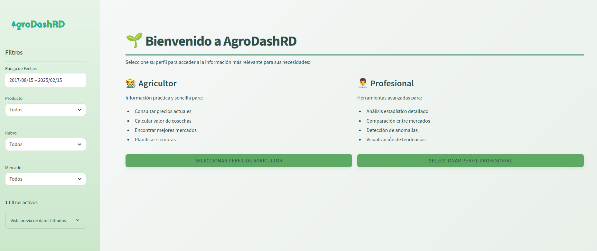

# AgroDashRD - Dominican Agricultural Sector Analysis Dashboard 🌱



## What is AgroDashRD?

AgroDashRD is a comprehensive platform for visualizing and analyzing agricultural sector data in the Dominican Republic. Originally a monolithic dashboard, it has evolved into a modern architecture with a dedicated **Backend API** and a **Mobile App**.

## Architecture

The project is divided into two main components:

1.  **Backend (`backend/`)**: A robust REST API built with **FastAPI** (Python), using **PostgreSQL** for data storage and **SQLAlchemy** for ORM. It handles authentication, data management, and ML predictions.
2.  **Mobile App (`mobile_app/`)**: A cross-platform mobile application built with **Flutter**, designed for farmers and professionals to access data on the go.

> **Note:** The original Dash/Streamlit application is preserved in the `legacy/` directory for reference.

## Features

### For Farmers 👨‍🌾
- **Current Prices**: Check real-time market prices.
- **Harvest Calculator**: Estimate harvest value.
- **Best Markets**: Find the most profitable markets.

### For Professionals 📊
- **Value Chain Analysis**: Track product flow.
- **Price Forecasts**: ML-powered price predictions.
- **Statistical Analysis**: In-depth metrics.

## Getting Started

### Prerequisites
- Python 3.12+
- Flutter SDK
- Docker & Docker Compose (Recommended)

### Quick Start (Development)

The easiest way to start the backend is using the provided script:

```bash
./start_dev.sh
```

This will check for dependencies and launch the backend (using Docker if available, or local Python otherwise).

### Manual Setup

#### Backend
See [backend/README.md](backend/README.md) for detailed instructions.

1.  Create a virtual environment and install dependencies:
    ```bash
    cd backend
    python -m venv venv
    source venv/bin/activate
    pip install -r requirements.txt
    ```
2.  Run the server:
    ```bash
    uvicorn backend.app.main:app --reload
    ```
    API Docs: http://localhost:8000/docs

#### Mobile App
See `mobile_app/` for the Flutter project.

1.  Navigate to the directory:
    ```bash
    cd mobile_app
    ```
2.  Install dependencies:
    ```bash
    flutter pub get
    ```
3.  Run the app:
    ```bash
    flutter run
    ```
    *Note: Ensure the backend is running first.*

## Documentation

- **[CONFIGURACION_PENDIENTE.md](CONFIGURACION_PENDIENTE.md)**: Detailed configuration guide and pending tasks.
- **[GUIA_DESPLIEGUE.md](GUIA_DESPLIEGUE.md)**: Deployment instructions.
- **[INFORME_AUDITORIA.md](INFORME_AUDITORIA.md)**: Audit report.

## Data

Data is stored in PostgreSQL (or SQLite for local dev). Initial seed data can be loaded via:
```bash
python backend/scripts/seed_data.py
```

## Support

For questions, please open an issue or contact the development team.

---
Developed with ❤️ for the Dominican agricultural sector.
